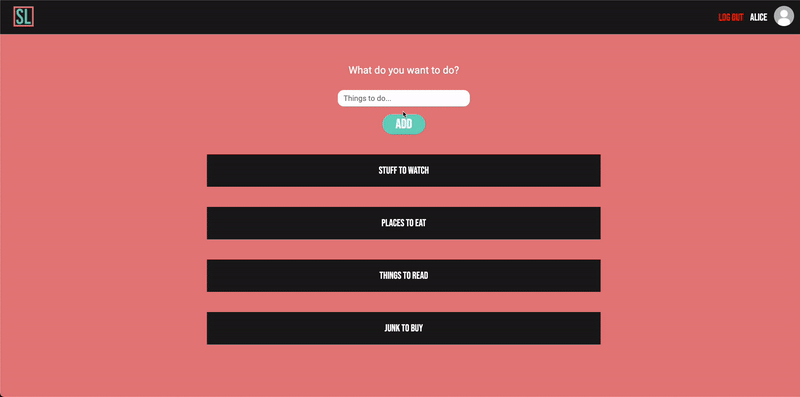

# Smart List

Smart List is an app that auto sorts list items using api calls and a custom sorting algorithm. Built with Express.js, SASS, jQuery, EJS, Ajax Google Books API, IMDB API, and Yelp API.

---

## Demo



---

## Stack

Javascript

Express.js

Axios

bcrypt

EJS

SASS

---

## dependencies

```
axios: ^0.24.0,
bcrypt: ^5.0.1,
bcryptjs: ^2.4.3,
cookie-session: ^1.4.0,
dotenv: ^2.0.0,
ejs: ^2.6.2,
express: ^4.17.1,
morgan: ^1.9.1,
pg: ^8.5.0,
pg-native: ^3.0.0,
sass: ^1.35.1
```
